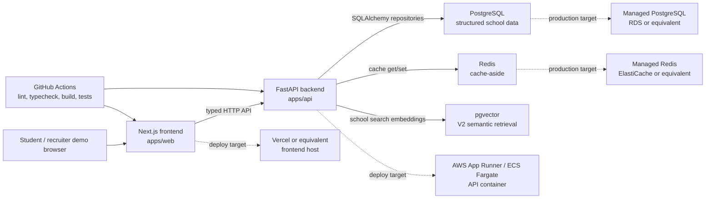

# College Exploration Platform

College Exploration Platform is a full-stack college decision-support product that helps students discover, rank, save, and compare schools with transparent data and deterministic scoring.

Status: V2.8 analytics and ranking evaluation are locally implemented after V2.7 shareable decision reports. The app has a Next.js frontend, FastAPI backend, PostgreSQL schema and seed data, Redis cache-aside, Docker packaging, CI checks, deployment documentation, deterministic public-college-snapshot ingestion, explainable hybrid semantic search, profile-page similar-school exploration, accepted-school decision summaries, transparent cost/value estimates, ranking sensitivity analysis, printable decision briefing reports, and privacy-safe internal analytics. Public cloud deployment, authenticated persistence, production-grade sharing, and full official dataset ingestion remain future work.

## Product Overview

The platform is built around a practical student workflow:

- Capture preferences for academics, cost, career goals, location, campus life, and admissions realism.
- Search schools with structured filters and typed API contracts.
- Rank candidate schools through deterministic, explainable scoring.
- Save schools locally, compare finalists side by side, enter acceptance offer details, and surface missing data honestly.

The product is not admissions advice, financial advice, or a guarantee of outcomes. It is an exploration and decision-support tool that makes tradeoffs visible.

## Product Thesis

Most college search tools are either broad directories or black-box recommendation surfaces. This project treats college choice as a data-backed decision workflow: structured school facts enter the backend, deterministic ranking logic scores fit against student preferences, and the frontend turns that into a shortlist and comparison workspace.

The engineering thesis is that a consumer-facing product can stay trustworthy when ranking, cache behavior, API contracts, and data limitations are explicit.

## Key Features

- Next.js App Router frontend with landing, onboarding, search, school profile, dashboard, and comparison routes.
- FastAPI backend with health, readiness, structured search, school profile, and deterministic ranking endpoints.
- PostgreSQL schema for schools, academics, costs, outcomes, campus life, users, saved schools, comparisons, and events.
- Synthetic deterministic seed dataset for local development and tests.
- Redis cache-aside for repeated search, profile, and ranking responses with versioned keys and TTLs.
- Deterministic V2.1 ingestion pipeline for small public college-data snapshots.
- pgvector-backed V2.2 semantic retrieval with deterministic local fallback and final ranking controlled by structured scoring.
- V2.3 similar-school discovery with explainable variants for cheaper, smaller, less selective, stronger outcomes, and closer-to-home alternatives.
- V2.4 accepted-school decision workspace with offer cards, notes, finalist comparison, deterministic summary categories, and uncertainty flags.
- V2.5 cost/value calculator with editable tuition, aid, scholarship, yearly cost, loan assumptions, four-year cost differences, basic repayment scenarios, directional value labels, affordability warnings, and estimate disclaimers.
- V2.6 sensitivity analysis with category-weight sliders, deterministic scenario reranking, rank movement indicators, stable/volatile choice badges, confidence impacts, and explainable category drivers.
- V2.7 shareable decision report with best-fit/value/career/risk recommendations, finalist ranking table, category scores, cost/value comparison, sensitivity highlights, unresolved questions, methodology note, local share route, and print-ready layout.
- V2.8 analytics and ranking evaluation with typed privacy-safe events, internal `/analytics` dashboard, ranking-version usage, reason-code frequency, confidence distribution, save-rate buckets, compare-rate buckets, and documented bias/limitations.
- Browser-local saved-school and comparison state for V1 demo flows.
- Playwright smoke coverage for onboarding, search, profiles, saved schools, and compare behavior.
- Docker Compose support for frontend, backend, PostgreSQL, and Redis.

## Architecture Overview



Request flow is `frontend -> FastAPI routes -> services -> repositories -> PostgreSQL`, with Redis isolated behind a cache service. Ranking logic lives in the backend service layer and does not depend on LLM output.

See [docs/architecture.md](docs/architecture.md) for the deeper architecture notes.

## Tech Stack

| Layer | Tooling |
| --- | --- |
| Frontend | Next.js 15, React 19, TypeScript, Tailwind CSS, Playwright |
| Backend | FastAPI, Pydantic, SQLAlchemy, Alembic, pytest |
| Data | PostgreSQL 16 with pgvector, deterministic CSV seed data, public snapshot ingestion CLI |
| Cache | Redis 7 cache-aside |
| DevOps | Docker Compose, GitHub Actions, Vercel/AWS deployment notes |
| V2 recommendation | deterministic ingestion, pgvector semantic retrieval, similar-school discovery |

## Local Development Setup

Prerequisites:

- Python `>=3.12,<3.13`
- Node.js 22
- Docker Desktop or compatible Docker runtime

Create local environment variables:

```powershell
Copy-Item .env.example .env
```

Start PostgreSQL and Redis:

```powershell
docker compose up -d postgres redis
```

Set up the backend:

```powershell
py -3.12 -m venv .venv
.\.venv\Scripts\activate
python -m pip install --upgrade pip
python -m pip install -r apps/api/requirements.txt
cd apps/api
alembic upgrade head
python scripts/seed_database.py --reset
uvicorn main:app --reload
```

Set up the frontend in a second terminal:

```powershell
cd apps/web
npm install
npm run dev
```

Useful local URLs:

- Frontend: `http://localhost:3000`
- API health: `http://127.0.0.1:8000/health`
- API readiness: `http://127.0.0.1:8000/ready`
- OpenAPI docs: `http://127.0.0.1:8000/docs`

Optional full Docker startup:

```powershell
docker compose up --build
```

The full Docker path starts web, API, PostgreSQL, and Redis. It runs migrations on API startup, but it does not reset or reseed the database automatically. Seed manually when needed:

```powershell
docker compose exec api python scripts/seed_database.py --reset
```

## Environment Variables

Local defaults live in [.env.example](.env.example). Production values should be configured through the hosting provider or cloud secret manager, not committed.

| Variable | Used by | Default | Notes |
| --- | --- | --- | --- |
| `APP_ENV` | API | `development` | Displayed by `/health`. |
| `DATABASE_URL` | API, Alembic, seed script | Local PostgreSQL URL | Use managed PostgreSQL in production. |
| `POSTGRES_DB`, `POSTGRES_USER`, `POSTGRES_PASSWORD`, `POSTGRES_PORT` | Docker Compose | Local dev values | Local-only container settings. Do not reuse local password in production. |
| `NEXT_PUBLIC_API_BASE_URL` | Web | `http://localhost:8000` | Public browser-facing API base URL. |
| `CORS_ORIGINS` | API | Local frontend origins | Comma-separated allowed browser origins. Avoid `*` in production. |
| `REDIS_URL` | API | `redis://localhost:6379/0` | Use managed Redis or disable with `REDIS_ENABLED=false`. |
| `REDIS_ENABLED` | API | `true` | API falls back to PostgreSQL reads when disabled or unavailable. |
| `CACHE_KEY_VERSION` | API | `v1` | Manual namespace bump for cache invalidation. |
| `CACHE_SEARCH_TTL_SECONDS` | API | `300` | Search response TTL. |
| `CACHE_PROFILE_TTL_SECONDS` | API | `3600` | Profile response TTL. |
| `CACHE_RANKING_TTL_SECONDS` | API | `300` | Ranking response TTL. |

## API Overview

Implemented endpoints:

- `GET /health`: process health, no database dependency.
- `GET /ready`: database readiness via `SELECT 1`.
- `GET /schools/search`: structured filters, deterministic sorting, pagination, search-card response fields.
- `GET /schools/{id}`: full profile assembled from school, academics, cost, outcome, and campus-life tables.
- `POST /rankings`: deterministic fit ranking against a preference profile.
- `POST /semantic-search`: natural-language school search with hybrid retrieval, hard constraints, deterministic re-ranking, and reason tags.
- `GET /schools/{id}/similar`: explainable similar-school alternatives with deterministic variant logic.
- `POST /decision/offers` and `GET /decision/offers`: create/update and list accepted/finalist offer details.
- `POST /decision/report`: generate a structured, explainable decision report for accepted/finalist schools.
- `POST /cost-calculator`: compare school cost assumptions, estimated four-year totals, debt exposure, repayment scenarios, affordability, and directional value.
- `POST /sensitivity`: rerank schools under weight scenarios and return movement, stable/volatile classifications, category drivers, confidence impacts, and tradeoff explanations.
- `POST /analytics/events` and `GET /analytics/summary`: privacy-safe product telemetry and internal ranking evaluation summaries.

API docs are generated locally at `http://127.0.0.1:8000/docs`. The contract details live in [docs/api-contract.md](docs/api-contract.md).

## Data Ingestion

V2.1 adds a deterministic backend ingestion CLI for public college-data style CSV snapshots. Raw datasets should stay out of git under `data/raw`; generated processed CSVs are written under `data/processed` and are also ignored by git.

```powershell
cd apps/api
python scripts/ingest_college_data.py import --raw-file ..\..\data\raw\college_snapshot.csv --source-year 2024 --data-version scorecard-2024
python scripts/ingest_college_data.py validate --raw-file ..\..\data\raw\college_snapshot.csv --source-year 2024 --data-version scorecard-2024
python scripts/ingest_college_data.py seed --raw-file ..\..\data\raw\college_snapshot.csv --output-file ..\..\data\processed\schools_ingested.csv --source-year 2024 --data-version scorecard-2024
python scripts/ingest_college_data.py refresh --raw-file ..\..\data\raw\college_snapshot.csv --output-file ..\..\data\processed\schools_ingested.csv --source-year 2024 --data-version scorecard-2024
python scripts/seed_database.py --reset --seed-file ..\..\data\processed\schools_ingested.csv
```

The stages are raw import, normalization, missing-value handling, derived attributes, validation, and seed/refresh output. Missing numeric values remain blank in CSV output and load as `NULL`, not `0`.

## Semantic Search

V2.2 adds `POST /semantic-search`. It builds school search documents from structured fields, retrieves pgvector candidates when embeddings exist, applies structured filters and hard constraints, then re-ranks with the deterministic ranking engine.

Generate local deterministic embeddings after migrations and seeding:

```powershell
cd apps/api
python scripts/refresh_embeddings.py
```

The CLI uses the built-in `local-hash-embedding-v1` provider, so tests and local development do not require paid API keys. If embeddings are missing or pgvector is unavailable, the endpoint uses a deterministic lexical fallback over the same generated school documents.

## Similar Schools

V2.3 adds a profile-page similar-school section powered by `GET /schools/{id}/similar`. It reuses semantic school documents and deterministic ranking signals, excludes the current school, and supports variants:

- `general`
- `cheaper`
- `less_selective`
- `smaller`
- `stronger_outcomes`
- `closer_to_home`

Variant logic is bounded and deterministic. For example, `cheaper` requires a lower known net price when both schools have price data, `smaller` requires lower enrollment when known, and `less_selective` requires a higher acceptance rate when known.

## Acceptance Decisions And Cost Value

V2.4 adds an accepted-schools workspace at `/decision`. Students can mark saved schools as accepted or finalist, enter aid offers, scholarships, estimated yearly cost, visit notes, unresolved questions, and parent/student priority notes, then generate a report-ready decision summary.

The backend exposes `/decision/offers` for offer persistence and `/decision/report` for deterministic summaries. The report distinguishes best overall fit, best value, strongest career upside, lowest risk, and biggest unresolved factor. Missing offer costs, incomplete preferences, and missing outcomes metrics reduce decision confidence instead of being treated as zero.

V2.5 adds a cost/value calculator to `/decision` and `/compare`, backed by `POST /cost-calculator`. It estimates yearly and four-year cost from entered offers or known profile costs, compares each school against a baseline, shows debt exposure and basic lower/base/higher repayment scenarios, and uses known earnings, graduation, and repayment fields only for directional value labels. Missing aid, debt, or outcomes data lowers confidence and creates warnings instead of becoming zero.

V2.6 adds sensitivity analysis to `/compare`, backed by `POST /sensitivity`. Students can adjust academic fit, cost/value, career outcomes, campus/lifestyle, location, prestige/selectivity, and admissions realism weights. The backend reruns the same deterministic ranking engine for each scenario and returns rank deltas, stable choices, volatile choices, category drivers, confidence impacts, and tradeoff explanations. Prestige/selectivity is modeled as a selectivity-emphasis scenario over the existing admissions-realism scoring path, not as a separate opaque score.

V2.7 expands `POST /decision/report` and adds `/decision/report` in the frontend. The report is a parent/counselor-friendly briefing document with recommendation cards, finalist ranking, category scores, cost/value rows, sensitivity highlights, unresolved questions, confidence flags, and methodology/disclaimer language. The current shareability layer is intentionally lightweight: the latest report is stored in browser local storage and presented through a clean printable route for screenshots, demos, and future PDF export.

The workflow is a planning assistant, not admissions or financial advice.

## Analytics And Ranking Evaluation

V2.8 adds typed analytics events and an internal `/analytics` page. The backend tracks structured, privacy-safe events for search, semantic search, school profile views, saves, compares, onboarding completion, ranking generation, sensitivity adjustments, and decision report generation. Events include version-aware ranking metadata where relevant, such as `ranking_version`, fit-score bucket inputs, confidence, rank position, reason codes, and category-weight summaries.

The internal analytics summary reports most-used filters, most-viewed/saved schools, compare frequency, onboarding completion rate, report generation frequency, ranking-version usage, save rate by fit-score bucket, compare rate by ranking position, top reason-code frequency, confidence distribution, and category weights associated with saved schools.

These metrics are descriptive, not causal. The implementation intentionally avoids logging sensitive notes, raw search text, aid amounts, scholarships, offer costs, emails, or free-form preference narratives.

See [docs/privacy-limitations.md](docs/privacy-limitations.md) for privacy-safe logging rules and evaluation caveats.

## Ranking Methodology Summary

Ranking is deterministic and versioned as `v1.0`. The backend computes category scores for academic fit, cost, career, location, campus, and admissions realism, then normalizes user weights and returns:

- `fit_score` from weighted category scores.
- `confidence_score` from available data coverage.
- `category_scores` for explainability.
- `top_reasons` and `top_tradeoffs` as deterministic reason codes.

Missing data is unknown, not zero. LLM-generated prose does not create school facts or alter ranking. See [docs/scoring-methodology.md](docs/scoring-methodology.md).

## Redis / Cache Summary

Redis is used as an optional cache-aside layer for read-heavy responses:

| Resource | TTL | Validation status |
| --- | --- | --- |
| Search | 5 minutes | Tests verify second identical call avoids repository work. |
| School profile | 60 minutes | Tests verify cache hit avoids repository work. |
| Ranking | 5 minutes | Tests verify cached response avoids ranking candidate repository work. |
| Similar schools | 5 minutes | Tests verify repeated similar-school calls use cache. |
| Sensitivity analysis | 5 minutes | Uses ranking TTL and keys including normalized preference/profile snapshot and `RANKING_VERSION`. |

Cache keys include `CACHE_KEY_VERSION`; ranking keys also include `RANKING_VERSION`. Redis outages log a fallback and continue with database reads.

## Deployment Overview

The repository is deployment-ready but not currently publicly hosted.

Recommended production-like deployment:

- Frontend: Vercel or equivalent Next.js host from `apps/web`.
- Backend: AWS App Runner or ECS/Fargate using `apps/api/Dockerfile`.
- PostgreSQL: managed PostgreSQL such as AWS RDS with the `vector` extension available for semantic search.
- Redis: managed Redis such as AWS ElastiCache.
- CI: GitHub Actions runs frontend lint/typecheck/build, Playwright smoke tests, backend tests, and Docker Compose config validation.

See [docs/deployment.md](docs/deployment.md) for environment setup, startup order, and hosting notes.

## Testing Instructions

Backend:

```powershell
.\.venv\Scripts\activate
cd apps/api
pytest
```

Frontend:

```powershell
cd apps/web
npm run lint
npm run typecheck
npm run build
npm run test:e2e
```

Docker validation:

```powershell
docker compose config
docker compose up --build
```

## Performance / Engineering Metrics

Current metrics are intentionally limited to verified local evidence. See [docs/performance.md](docs/performance.md) for the running notes.

- Search indexes exist for common filters and sorts on state, region, type, setting, enrollment, acceptance rate, graduation rate, tuition, and net price.
- Cache tests verify repeated search/profile/ranking calls can avoid duplicate repository/database work.
- Cache hit/miss logs include lightweight `db_call_avoided` and `db_call_required` flags.
- No production p95, uptime, real-user usage, cache hit-rate, or database reduction claims have been measured yet.

Future V3 work should add reproducible load tests, endpoint latency summaries, query plans, and cache hit-rate reporting before making stronger performance claims.

## Screenshots / Demo Assets

No real screenshots or GIFs are committed yet. The capture checklist is maintained in [docs/screenshots.md](docs/screenshots.md) and covers:

- Landing page
- Onboarding
- Search/ranked search flow
- School profile
- Similar schools variants on the school profile
- Saved schools dashboard
- Compare workflow
- Cost/value calculator in compare and accepted-school decision workflows
- Sensitivity analysis sliders, movement table, and stable/volatile badges in compare workflow
- Shareable decision report with printable briefing layout
- Internal analytics and ranking evaluation dashboard

Screenshots should be added only after capturing the real running product.

## Known Limitations

- Seed data is synthetic or fixture-sized and intended for deterministic development, not factual school reporting.
- Saved schools and comparisons are browser-local in V1 because authentication is not implemented.
- The accepted-schools UI keeps browser-local offer and latest-report state for recruiter-demo continuity; backend decision endpoints are available for the future authenticated persistence path.
- The frontend search UI does not yet call `POST /rankings`; deterministic ranking is available through the API.
- Full official dataset operations, production-grade observability, production-grade report sharing, rate limiting, and account persistence are future work.
- Deployment configuration is documented and Dockerized, but no public hosted environment has been verified.
- Performance claims are not production measurements.

## Future Roadmap

V2 focuses on recommendation and decision intelligence:

- V2.1 Data ingestion pipeline
- V2.2 pgvector semantic search
- V2.3 Similar-school discovery
- V2.4 Acceptance decision mode
- V2.5 Cost/value calculator
- V2.6 Sensitivity analysis
- V2.7 Shareable decision report
- V2.8 Analytics and ranking evaluation

V3 focuses on hardening:

- Authentication and account persistence
- Observability and performance dashboards
- Load testing and query optimization
- Admin data quality tooling
- Security and privacy hardening
- Expanded end-to-end tests
- Portfolio/demo polish

See [tasks.md](tasks.md) for the working implementation tracker. The recommended next phase is **V3 Production Hardening and Portfolio Polish**.
