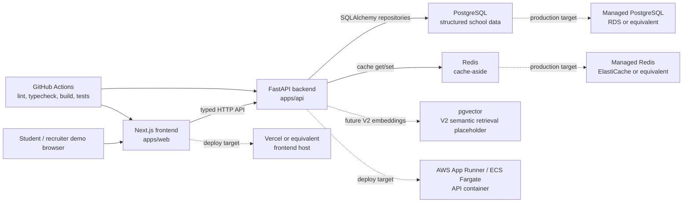

# College Exploration Platform

College Exploration Platform is a full-stack college decision-support product that helps students discover, rank, save, and compare schools with transparent data and deterministic scoring.

Status: V1.13 deployment and README polish complete. The app has a Next.js frontend, FastAPI backend, PostgreSQL schema and seed data, Redis cache-aside, Docker packaging, CI checks, and deployment documentation. Public cloud deployment, authenticated persistence, pgvector semantic search, and official college-data ingestion remain future work.

## Product Overview

The platform is built around a practical student workflow:

- Capture preferences for academics, cost, career goals, location, campus life, and admissions realism.
- Search schools with structured filters and typed API contracts.
- Rank candidate schools through deterministic, explainable scoring.
- Save schools locally, compare finalists side by side, and surface missing data honestly.

The product is not admissions advice, financial advice, or a guarantee of outcomes. It is an exploration and decision-support tool that makes tradeoffs visible.

## Product Thesis

Most college search tools are either broad directories or black-box recommendation surfaces. This project treats college choice as a data-backed decision workflow: structured school facts enter the backend, deterministic ranking logic scores fit against student preferences, and the frontend turns that into a shortlist and comparison workspace.

The engineering thesis is that a consumer-facing product can stay trustworthy when ranking, cache behavior, API contracts, and data limitations are explicit.

## Key Features

- Next.js App Router frontend with landing, onboarding, search, school profile, dashboard, and comparison routes.
- FastAPI backend with health, readiness, structured search, school profile, and deterministic ranking endpoints.
- PostgreSQL schema for schools, academics, costs, outcomes, campus life, users, saved schools, comparisons, and events.
- Synthetic deterministic seed dataset for local development and tests.
- Redis cache-aside for repeated search, profile, and ranking responses with versioned keys and TTLs.
- Browser-local saved-school and comparison state for V1 demo flows.
- Playwright smoke coverage for onboarding, search, profiles, saved schools, and compare behavior.
- Docker Compose support for frontend, backend, PostgreSQL, and Redis.

## Architecture Overview



Request flow is `frontend -> FastAPI routes -> services -> repositories -> PostgreSQL`, with Redis isolated behind a cache service. Ranking logic lives in the backend service layer and does not depend on LLM output.

See [docs/architecture.md](docs/architecture.md) for the deeper architecture notes.

## Tech Stack

| Layer | Tooling |
| --- | --- |
| Frontend | Next.js 15, React 19, TypeScript, Tailwind CSS, Playwright |
| Backend | FastAPI, Pydantic, SQLAlchemy, Alembic, pytest |
| Data | PostgreSQL 16, deterministic CSV seed data |
| Cache | Redis 7 cache-aside |
| DevOps | Docker Compose, GitHub Actions, Vercel/AWS deployment notes |
| Future V2 | pgvector semantic retrieval, data ingestion pipeline, similar-school discovery |

## Local Development Setup

Prerequisites:

- Python `>=3.12,<3.13`
- Node.js 22
- Docker Desktop or compatible Docker runtime

Create local environment variables:

```powershell
Copy-Item .env.example .env
```

Start PostgreSQL and Redis:

```powershell
docker compose up -d postgres redis
```

Set up the backend:

```powershell
py -3.12 -m venv .venv
.\.venv\Scripts\activate
python -m pip install --upgrade pip
python -m pip install -r apps/api/requirements.txt
cd apps/api
alembic upgrade head
python scripts/seed_database.py --reset
uvicorn main:app --reload
```

Set up the frontend in a second terminal:

```powershell
cd apps/web
npm install
npm run dev
```

Useful local URLs:

- Frontend: `http://localhost:3000`
- API health: `http://127.0.0.1:8000/health`
- API readiness: `http://127.0.0.1:8000/ready`
- OpenAPI docs: `http://127.0.0.1:8000/docs`

Optional full Docker startup:

```powershell
docker compose up --build
```

The full Docker path starts web, API, PostgreSQL, and Redis. It runs migrations on API startup, but it does not reset or reseed the database automatically. Seed manually when needed:

```powershell
docker compose exec api python scripts/seed_database.py --reset
```

## Environment Variables

Local defaults live in [.env.example](.env.example). Production values should be configured through the hosting provider or cloud secret manager, not committed.

| Variable | Used by | Default | Notes |
| --- | --- | --- | --- |
| `APP_ENV` | API | `development` | Displayed by `/health`. |
| `DATABASE_URL` | API, Alembic, seed script | Local PostgreSQL URL | Use managed PostgreSQL in production. |
| `POSTGRES_DB`, `POSTGRES_USER`, `POSTGRES_PASSWORD`, `POSTGRES_PORT` | Docker Compose | Local dev values | Local-only container settings. Do not reuse local password in production. |
| `NEXT_PUBLIC_API_BASE_URL` | Web | `http://localhost:8000` | Public browser-facing API base URL. |
| `CORS_ORIGINS` | API | Local frontend origins | Comma-separated allowed browser origins. Avoid `*` in production. |
| `REDIS_URL` | API | `redis://localhost:6379/0` | Use managed Redis or disable with `REDIS_ENABLED=false`. |
| `REDIS_ENABLED` | API | `true` | API falls back to PostgreSQL reads when disabled or unavailable. |
| `CACHE_KEY_VERSION` | API | `v1` | Manual namespace bump for cache invalidation. |
| `CACHE_SEARCH_TTL_SECONDS` | API | `300` | Search response TTL. |
| `CACHE_PROFILE_TTL_SECONDS` | API | `3600` | Profile response TTL. |
| `CACHE_RANKING_TTL_SECONDS` | API | `300` | Ranking response TTL. |

## API Overview

Implemented endpoints:

- `GET /health`: process health, no database dependency.
- `GET /ready`: database readiness via `SELECT 1`.
- `GET /schools/search`: structured filters, deterministic sorting, pagination, search-card response fields.
- `GET /schools/{id}`: full profile assembled from school, academics, cost, outcome, and campus-life tables.
- `POST /rankings`: deterministic fit ranking against a preference profile.

API docs are generated locally at `http://127.0.0.1:8000/docs`. The contract details live in [docs/api-contract.md](docs/api-contract.md).

## Ranking Methodology Summary

Ranking is deterministic and versioned as `v1.0`. The backend computes category scores for academic fit, cost, career, location, campus, and admissions realism, then normalizes user weights and returns:

- `fit_score` from weighted category scores.
- `confidence_score` from available data coverage.
- `category_scores` for explainability.
- `top_reasons` and `top_tradeoffs` as deterministic reason codes.

Missing data is unknown, not zero. LLM-generated prose does not create school facts or alter ranking. See [docs/scoring-methodology.md](docs/scoring-methodology.md).

## Redis / Cache Summary

Redis is used as an optional cache-aside layer for read-heavy responses:

| Resource | TTL | Validation status |
| --- | --- | --- |
| Search | 5 minutes | Tests verify second identical call avoids repository work. |
| School profile | 60 minutes | Tests verify cache hit avoids repository work. |
| Ranking | 5 minutes | Tests verify cached response avoids ranking candidate repository work. |

Cache keys include `CACHE_KEY_VERSION`; ranking keys also include `RANKING_VERSION`. Redis outages log a fallback and continue with database reads.

## Deployment Overview

The repository is deployment-ready but not currently publicly hosted.

Recommended production-like deployment:

- Frontend: Vercel or equivalent Next.js host from `apps/web`.
- Backend: AWS App Runner or ECS/Fargate using `apps/api/Dockerfile`.
- PostgreSQL: managed PostgreSQL such as AWS RDS.
- Redis: managed Redis such as AWS ElastiCache.
- CI: GitHub Actions runs frontend lint/typecheck/build, Playwright smoke tests, backend tests, and Docker Compose config validation.

See [docs/deployment.md](docs/deployment.md) for environment setup, startup order, and hosting notes.

## Testing Instructions

Backend:

```powershell
.\.venv\Scripts\activate
cd apps/api
pytest
```

Frontend:

```powershell
cd apps/web
npm run lint
npm run typecheck
npm run build
npm run test:e2e
```

Docker validation:

```powershell
docker compose config
docker compose up --build
```

## Performance / Engineering Metrics

Current metrics are intentionally limited to verified local evidence. See [docs/performance.md](docs/performance.md) for the running notes.

- Search indexes exist for common filters and sorts on state, region, type, setting, enrollment, acceptance rate, graduation rate, tuition, and net price.
- Cache tests verify repeated search/profile/ranking calls can avoid duplicate repository/database work.
- Cache hit/miss logs include lightweight `db_call_avoided` and `db_call_required` flags.
- No production p95, uptime, real-user usage, cache hit-rate, or database reduction claims have been measured yet.

Future V3 work should add reproducible load tests, endpoint latency summaries, query plans, and cache hit-rate reporting before making stronger performance claims.

## Screenshots / Demo Assets

No real screenshots or GIFs are committed yet. The capture checklist is maintained in [docs/screenshots.md](docs/screenshots.md) and covers:

- Landing page
- Onboarding
- Search/ranked search flow
- School profile
- Saved schools dashboard
- Compare workflow

Screenshots should be added only after capturing the real running product.

## Known Limitations

- Seed data is synthetic and intended for deterministic development, not factual school reporting.
- Saved schools and comparisons are browser-local in V1 because authentication is not implemented.
- The frontend search UI does not yet call `POST /rankings`; deterministic ranking is available through the API.
- pgvector semantic search, similar schools, official data ingestion, analytics, rate limiting, and account persistence are future work.
- Deployment configuration is documented and Dockerized, but no public hosted environment has been verified.
- Performance claims are not production measurements.

## Future Roadmap

V2 focuses on recommendation and decision intelligence:

- V2.1 Data ingestion pipeline
- V2.2 pgvector semantic search
- V2.3 Similar-school discovery
- V2.4 Acceptance decision mode
- V2.5 Cost/value calculator
- V2.6 Sensitivity analysis
- V2.7 Shareable decision report
- V2.8 Analytics and ranking evaluation

V3 focuses on hardening:

- Authentication and account persistence
- Observability and performance dashboards
- Load testing and query optimization
- Admin data quality tooling
- Security and privacy hardening
- Expanded end-to-end tests
- Portfolio/demo polish

## Resume-Aligned Engineering Highlights

- Built a typed full-stack decision platform with Next.js, FastAPI, PostgreSQL, Redis, Docker, and GitHub Actions.
- Implemented structured search over normalized school tables with SQLAlchemy repositories, parameterized queries, pagination, and indexed fields.
- Developed a deterministic, versioned ranking engine with category scores, confidence, hard constraints, reason codes, and stable ordering.
- Added Redis cache-aside for search, profile, and ranking responses with versioned keys, TTL policy, fallback behavior, and tests proving repeated calls avoid repository work.
- Designed V1 product workflows across onboarding, search, school profiles, saved schools, and comparison while keeping data limitations visible.

See [tasks.md](tasks.md) for the working implementation tracker. The recommended next step is **V2.1 Data ingestion pipeline**.
