<div align="center">

# 🎓 College Exploration Platform

**A full-stack college decision-support product — discover, rank, save, and compare schools with transparent data and deterministic, explainable scoring.**

[](https://nextjs.org/)
[](https://react.dev/)
[](https://www.typescriptlang.org/)
[](https://fastapi.tiangolo.com/)
[](https://www.python.org/)
[](https://www.postgresql.org/)
[](https://redis.io/)
[](https://www.docker.com/)
[](LICENSE)

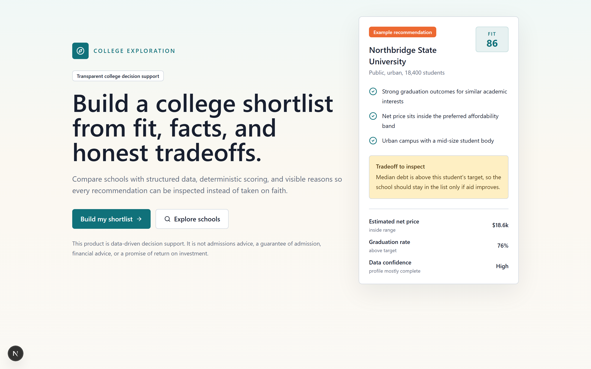

</div>

---

College choice is a high-stakes, data-rich decision that most tools treat as either a broad directory or a black-box recommendation feed. This project treats it as an **engineered decision workflow**: structured school facts enter a typed backend, deterministic ranking logic scores fit against a student's stated preferences, and the frontend turns that into a shortlist, comparison workspace, and shareable decision briefing.

The guiding engineering thesis is that a consumer product can stay **trustworthy** when ranking logic, cache behavior, API contracts, and data limitations are all explicit. Rankings are deterministic and versioned, missing data is never silently treated as zero, and language models never invent school facts or alter scores.

> [!IMPORTANT]
> **Project history:** A much older version of College Explorer was previously deployed on AWS and saw approximately 6,000 unique users. The current codebase is a substantially improved portfolio project that I returned to later; it is not that original production deployment and is not currently presented as a live production service.

> [!NOTE]
> This is a decision-support and exploration tool — **not** admissions advice, financial advice, or a guarantee of outcomes. Its job is to make tradeoffs visible.

## 📋 Table of Contents

- [Highlights](#-highlights)
- [Demo](#-demo)
- [Screenshots](#-screenshots)
- [Architecture](#-architecture)
- [Tech Stack](#-tech-stack)
- [Getting Started](#-getting-started)
- [Testing](#-testing)
- [Feature Deep-Dive](#-feature-deep-dive)
- [API Overview](#-api-overview)
- [How Ranking Works](#-how-ranking-works)
- [Caching](#-caching)
- [Performance & Honesty](#-performance--honesty)
- [Roadmap](#-roadmap)
- [Known Limitations](#-known-limitations)
- [License](#-license)

## ✨ Highlights

- 🧭 **Guided onboarding** captures a typed preference profile across academics, cost, career, location, campus, and admissions realism.
- 🔍 **Structured search** over a typed school dataset with filters, sorting, and pagination — backed by indexed SQL and a Redis cache-aside layer.
- 🧮 **Deterministic, versioned ranking** that produces a fit score, confidence score, per-category scores, and explainable reason/tradeoff codes.
- 🧠 **Hybrid semantic search** combining pgvector retrieval with hard constraints and a deterministic re-ranker (with a local fallback — no paid API keys required).
- 🔁 **Explainable "similar schools"** — cheaper, smaller, less selective, stronger outcomes, or closer to home, with bounded deterministic variant logic.
- 🎓 **Acceptance decision workspace** for entering aid offers and generating a side-by-side decision summary.
- 💰 **Cost / value calculator** with four-year totals, debt exposure, repayment scenarios, and affordability warnings.
- 🎚️ **Sensitivity analysis** — adjust category weights and watch rankings re-rank live, with stable vs. volatile choice badges.
- 📄 **Shareable, print-ready decision briefing** for students, parents, and counselors.
- 📊 **Privacy-safe internal analytics** dashboard for ranking evaluation and product telemetry.
- 🧱 **Honest by design** — missing data lowers confidence instead of becoming zero, and LLM output never creates facts or changes scores.

## 🎬 Demo

**Onboarding → search handoff** — a student builds a local preference profile, then lands in search with those preferences pre-applied.

<div align="center">
  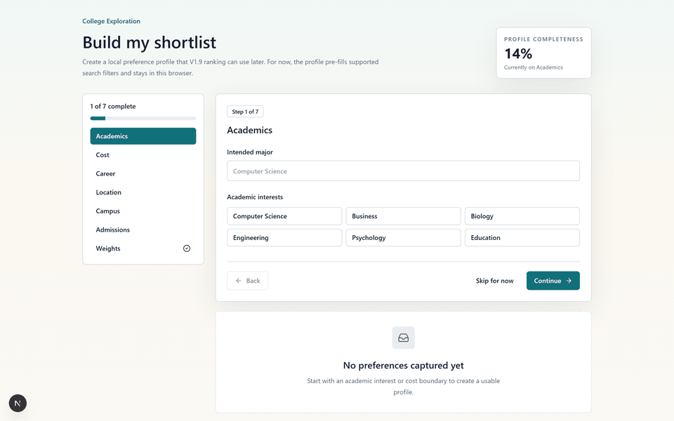
</div>

**Live sensitivity analysis** — dragging a category weight re-runs the deterministic ranker and updates rank movement, drivers, and stability badges in real time.

<div align="center">
  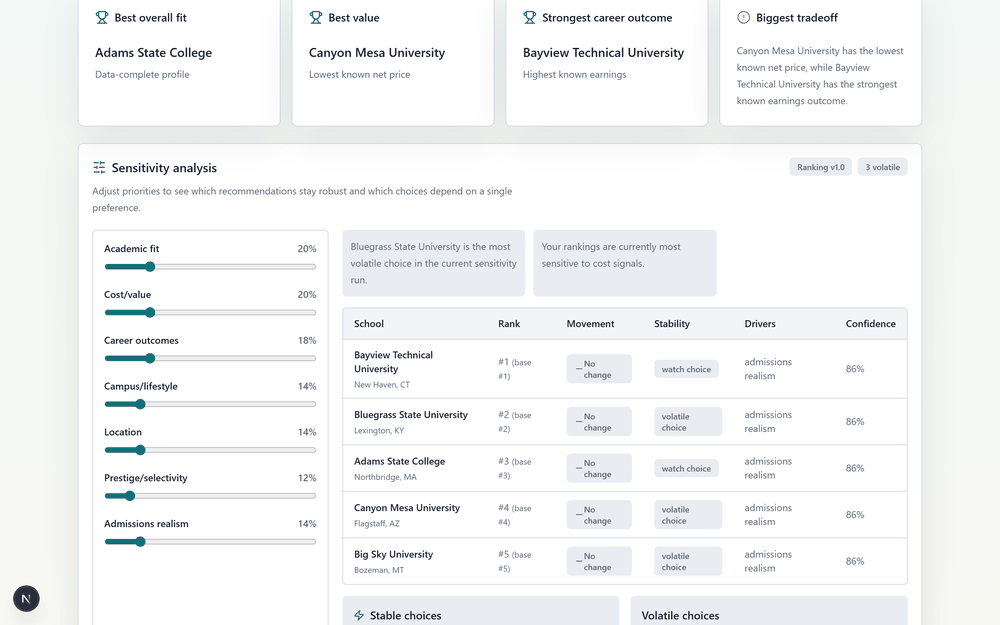
</div>

## 📸 Screenshots

<table>
  <tr>
    <td width="50%">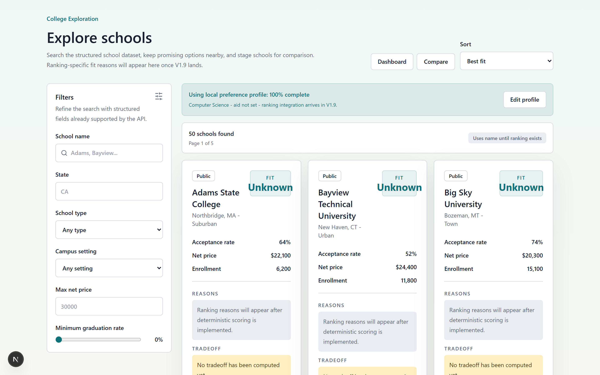<p align="center"><em>Structured search with filters &amp; result cards</em></p></td>
    <td width="50%">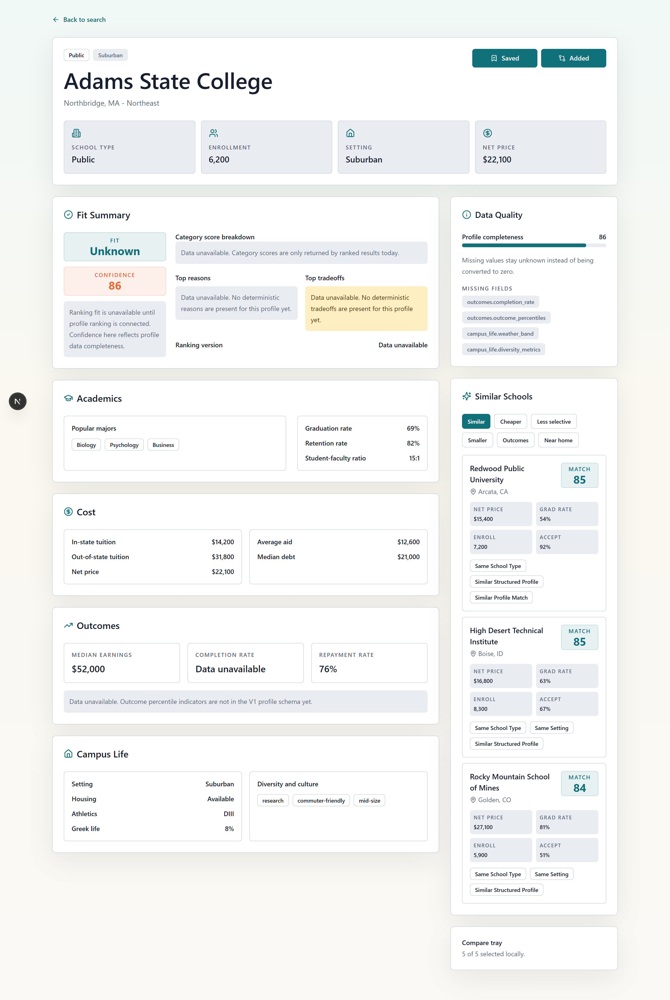<p align="center"><em>School profile with similar-school discovery</em></p></td>
  </tr>
  <tr>
    <td width="50%">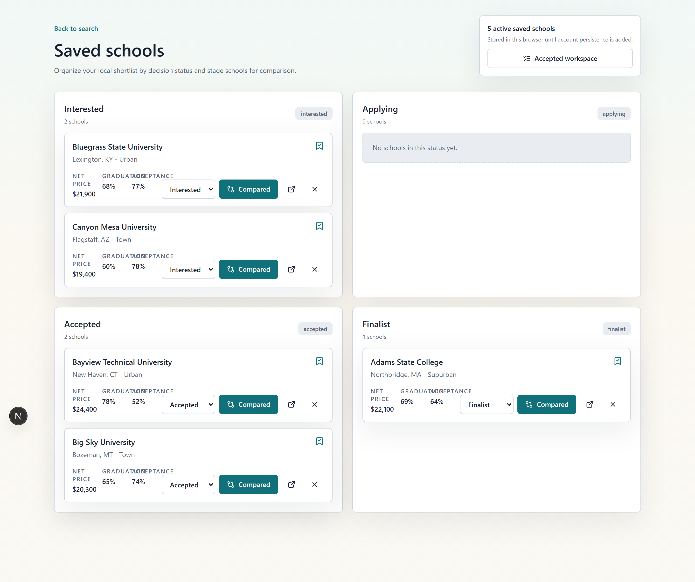<p align="center"><em>Saved-schools dashboard grouped by status</em></p></td>
    <td width="50%">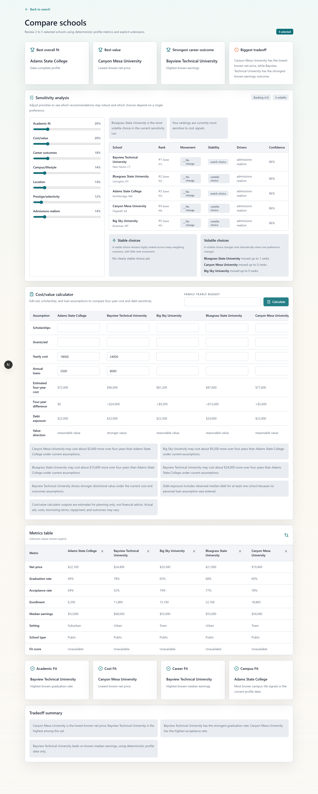<p align="center"><em>Compare workspace: metrics, cost/value &amp; sensitivity</em></p></td>
  </tr>
  <tr>
    <td width="50%">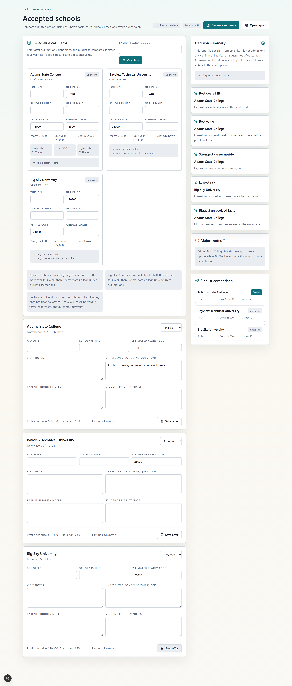<p align="center"><em>Accepted-school decision workspace</em></p></td>
    <td width="50%">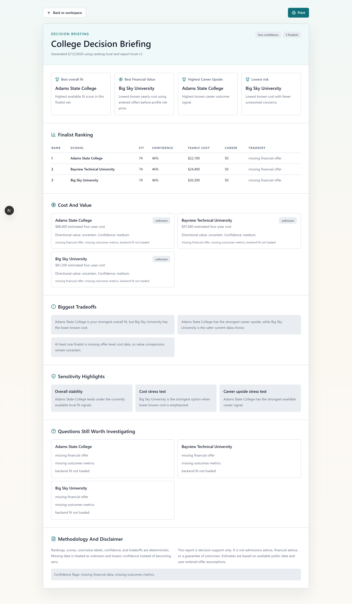<p align="center"><em>Print-ready decision briefing report</em></p></td>
  </tr>
  <tr>
    <td colspan="2">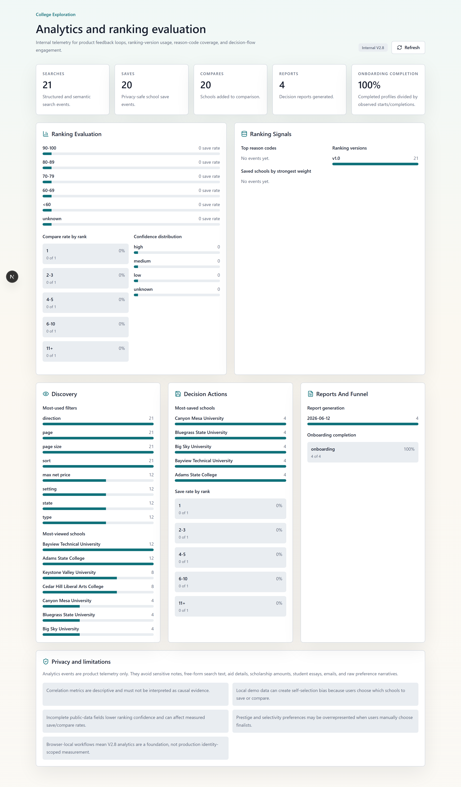<p align="center"><em>Internal analytics &amp; ranking-evaluation dashboard</em></p></td>
  </tr>
</table>

## 🏗 Architecture

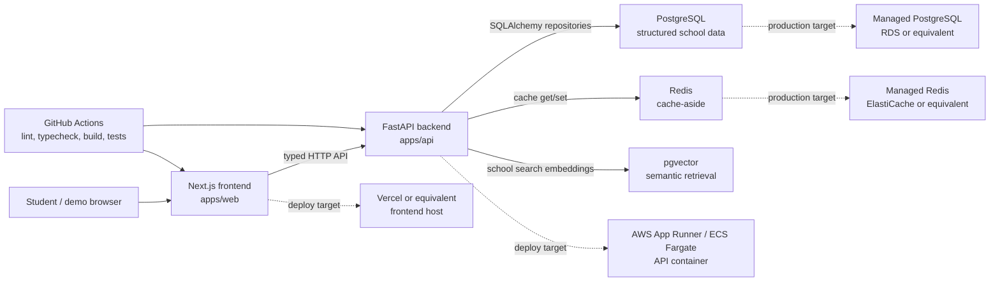

The request path is `frontend → FastAPI routes → services → repositories → PostgreSQL`, with Redis isolated behind a dedicated cache service and ranking logic living entirely in the backend service layer. SQL stays in the repository layer (never in route handlers), all responses are typed end to end (Pydantic on the backend, generated types on the frontend), and ranking never depends on LLM output.

See [docs/architecture.md](docs/architecture.md) for the deeper notes.

## 🧱 Tech Stack

| Layer | Tooling |
| --- | --- |
| **Frontend** | Next.js 15 (App Router), React 19, TypeScript, Tailwind CSS, shadcn/ui, Playwright |
| **Backend** | FastAPI, Pydantic, SQLAlchemy, Alembic, pytest |
| **Data** | PostgreSQL 16 with pgvector, deterministic CSV seed data, public-snapshot ingestion CLI |
| **Cache** | Redis 7 (cache-aside with versioned keys + TTLs) |
| **DevOps** | Docker Compose, GitHub Actions CI, Vercel / AWS deployment notes |
| **Recommendation** | Deterministic ingestion, pgvector semantic retrieval, explainable similar-school discovery |

## 🚀 Getting Started

### Prerequisites

- Python `>=3.12,<3.13`
- Node.js 22
- Docker Desktop (or a compatible Docker runtime)

### 1. Configure environment

```powershell
Copy-Item .env.example .env
```

### 2. Start infrastructure

```powershell
docker compose up -d postgres redis
```

### 3. Backend

```powershell
py -3.12 -m venv .venv
.\.venv\Scripts\activate
python -m pip install --upgrade pip
python -m pip install -r apps/api/requirements.txt
cd apps/api
alembic upgrade head
python scripts/seed_database.py --reset
uvicorn main:app --reload
```

### 4. Frontend (second terminal)

```powershell
cd apps/web
npm install
npm run dev
```

### Useful URLs

| Service | URL |
| --- | --- |
| Frontend | `http://localhost:3000` |
| API health | `http://127.0.0.1:8000/health` |
| API readiness | `http://127.0.0.1:8000/ready` |
| OpenAPI docs | `http://127.0.0.1:8000/docs` |

<details>
<summary><strong>Run the whole stack with Docker</strong></summary>

```powershell
docker compose up --build
```

This starts web, API, PostgreSQL, and Redis, and runs migrations on API startup. It does **not** reseed the database automatically — seed it manually when needed:

```powershell
docker compose exec api python scripts/seed_database.py --reset
```

</details>

<details>
<summary><strong>Environment variables</strong></summary>

Local defaults live in [.env.example](.env.example). Production values belong in your hosting provider or a cloud secret manager — never committed.

| Variable | Used by | Default | Notes |
| --- | --- | --- | --- |
| `APP_ENV` | API | `development` | Displayed by `/health`. |
| `DATABASE_URL` | API, Alembic, seed | Local PostgreSQL URL | Use managed PostgreSQL in production. |
| `POSTGRES_DB`, `POSTGRES_USER`, `POSTGRES_PASSWORD`, `POSTGRES_PORT` | Docker Compose | Local dev values | Local-only container settings. |
| `NEXT_PUBLIC_API_BASE_URL` | Web | `http://localhost:8000` | Public browser-facing API base URL. |
| `CORS_ORIGINS` | API | Local frontend origins | Comma-separated allowed origins. Avoid `*` in production. |
| `REDIS_URL` | API | `redis://localhost:6379/0` | Use managed Redis or disable with `REDIS_ENABLED=false`. |
| `REDIS_ENABLED` | API | `true` | API falls back to PostgreSQL reads when disabled/unavailable. |
| `CACHE_KEY_VERSION` | API | `v1` | Manual namespace bump for cache invalidation. |
| `CACHE_SEARCH_TTL_SECONDS` | API | `300` | Search response TTL. |
| `CACHE_PROFILE_TTL_SECONDS` | API | `3600` | Profile response TTL. |
| `CACHE_RANKING_TTL_SECONDS` | API | `300` | Ranking response TTL. |

</details>

## 🧪 Testing

**Backend**

```powershell
.\.venv\Scripts\activate
cd apps/api
pytest
```

**Frontend**

```powershell
cd apps/web
npm run lint
npm run typecheck
npm run build
npm run test:e2e
```

**Docker config validation**

```powershell
docker compose config
```

CI (GitHub Actions) runs frontend lint/typecheck/build, Playwright smoke tests, backend tests, and Docker Compose config validation.

## 📚 Feature Deep-Dive

<details>
<summary><strong>Data ingestion</strong> — deterministic CLI for public college-data snapshots</summary>

A backend CLI imports public college-data-style CSV snapshots through staged steps: raw import, normalization, missing-value handling, derived attributes, validation, and seed/refresh output. Raw datasets stay out of git under `data/raw`; processed CSVs land in `data/processed` (also git-ignored). Missing numeric values stay blank in CSV and load as `NULL` — never `0`.

```powershell
cd apps/api
python scripts/ingest_college_data.py import   --raw-file ..\..\data\raw\college_snapshot.csv --source-year 2024 --data-version scorecard-2024
python scripts/ingest_college_data.py validate --raw-file ..\..\data\raw\college_snapshot.csv --source-year 2024 --data-version scorecard-2024
python scripts/ingest_college_data.py seed     --raw-file ..\..\data\raw\college_snapshot.csv --output-file ..\..\data\processed\schools_ingested.csv --source-year 2024 --data-version scorecard-2024
python scripts/seed_database.py --reset --seed-file ..\..\data\processed\schools_ingested.csv
```

</details>

<details>
<summary><strong>Semantic search</strong> — pgvector retrieval with a deterministic re-ranker</summary>

`POST /semantic-search` builds school search documents from structured fields, retrieves pgvector candidates when embeddings exist, applies structured filters and hard constraints, then re-ranks with the deterministic ranking engine. Generate local embeddings after seeding:

```powershell
cd apps/api
python scripts/refresh_embeddings.py
```

The built-in `local-hash-embedding-v1` provider means tests and local dev need no paid API keys. If embeddings are missing or pgvector is unavailable, the endpoint falls back to a deterministic lexical search over the same documents.

</details>

<details>
<summary><strong>Similar schools</strong> — bounded, explainable alternatives</summary>

`GET /schools/{id}/similar` reuses semantic documents and deterministic ranking signals to surface alternatives via variants: `general`, `cheaper`, `less_selective`, `smaller`, `stronger_outcomes`, and `closer_to_home`. Variant logic is bounded and deterministic — e.g. `cheaper` requires a lower known net price when both schools have price data; `smaller` requires lower known enrollment; `less_selective` requires a higher known acceptance rate.

</details>

<details>
<summary><strong>Decisions, cost/value & sensitivity</strong></summary>

- **Acceptance decisions** (`/decision`, `POST /decision/offers`): mark saved schools accepted/finalist, enter aid offers, scholarships, estimated costs, visit notes, and unresolved questions, then generate a deterministic summary distinguishing best fit, best value, strongest career upside, lowest risk, and biggest unresolved factor.
- **Cost / value** (`POST /cost-calculator`): yearly and four-year cost estimates from offers or known profile costs, debt exposure, lower/base/higher repayment scenarios, and directional value labels from known earnings/graduation/repayment fields. Missing aid, debt, or outcomes data lowers confidence and raises warnings instead of becoming zero.
- **Sensitivity analysis** (`POST /sensitivity`): adjust academic, cost/value, career, campus, location, prestige/selectivity, and admissions-realism weights. The backend re-runs the same deterministic ranker per scenario and returns rank deltas, stable/volatile classifications, category drivers, confidence impacts, and tradeoff explanations.

The workflow is a planning assistant — not admissions or financial advice.

</details>

<details>
<summary><strong>Analytics & ranking evaluation</strong> — privacy-safe telemetry</summary>

Typed events track search, semantic search, profile views, saves, compares, onboarding completion, ranking generation, sensitivity adjustments, and report generation, with version-aware metadata (`ranking_version`, fit-score buckets, confidence, rank position, reason codes, category-weight summaries). The internal `/analytics` summary reports most-used filters, most-viewed/saved schools, compare frequency, onboarding completion, ranking-version usage, save rate by fit-score bucket, compare rate by ranking position, reason-code frequency, and confidence distribution.

Metrics are descriptive, not causal. The implementation deliberately avoids logging notes, raw search text, aid amounts, scholarships, offer costs, emails, or free-form preferences. See [docs/privacy-limitations.md](docs/privacy-limitations.md).

</details>

## 🔌 API Overview

<details>
<summary><strong>Implemented endpoints</strong></summary>

| Endpoint | Purpose |
| --- | --- |
| `GET /health` | Process health (no DB dependency). |
| `GET /ready` | Database readiness via `SELECT 1`. |
| `GET /schools/search` | Structured filters, deterministic sorting, pagination. |
| `GET /schools/{id}` | Full profile from school, academics, cost, outcome, and campus-life tables. |
| `POST /rankings` | Deterministic fit ranking against a preference profile. |
| `POST /semantic-search` | Natural-language search with hybrid retrieval, hard constraints, and deterministic re-ranking. |
| `GET /schools/{id}/similar` | Explainable similar-school alternatives. |
| `POST` / `GET /decision/offers` | Create/update and list accepted/finalist offer details. |
| `POST /decision/report` | Generate a structured, explainable decision report. |
| `POST /cost-calculator` | Cost assumptions, four-year totals, debt exposure, repayment, directional value. |
| `POST /sensitivity` | Re-rank under weight scenarios with movement and stability classifications. |
| `POST /analytics/events`, `GET /analytics/summary` | Privacy-safe telemetry and ranking-evaluation summaries. |

</details>

Interactive docs are generated locally at `http://127.0.0.1:8000/docs`; the full contract lives in [docs/api-contract.md](docs/api-contract.md).

## 🎯 How Ranking Works

Ranking is **deterministic** and versioned as `v1.0`. The backend computes category scores for academic fit, cost, career, location, campus, and admissions realism, normalizes user weights, and returns:

- `fit_score` — from weighted category scores
- `confidence_score` — from available data coverage
- `category_scores` — for explainability
- `top_reasons` and `top_tradeoffs` — as deterministic reason codes

Missing data is treated as *unknown*, never zero, and LLM-generated prose never creates school facts or alters a ranking. Every ranking change requires a bumped `ranking_version` constant. See [docs/scoring-methodology.md](docs/scoring-methodology.md).

## ⚡ Caching

Redis is an optional cache-aside layer for read-heavy responses. Cache keys include `CACHE_KEY_VERSION`; ranking keys also include `RANKING_VERSION`. A Redis outage logs a fallback and continues with database reads.

| Resource | TTL | Validation |
| --- | --- | --- |
| Search | 5 min | Tests verify a repeat call avoids repository work. |
| School profile | 60 min | Tests verify cache hits avoid repository work. |
| Ranking | 5 min | Tests verify cached responses avoid ranking-candidate queries. |
| Similar schools | 5 min | Tests verify repeated calls use the cache. |
| Sensitivity | 5 min | Keyed on normalized preference snapshot + `RANKING_VERSION`. |

## 📈 Performance & Honesty

Performance claims are limited to **verified local evidence** — no invented numbers.

- Indexes exist for common filters/sorts (state, region, type, setting, enrollment, acceptance rate, graduation rate, tuition, net price).
- Cache tests verify repeated search/profile/ranking calls can avoid duplicate database work.
- Cache logs include lightweight `db_call_avoided` / `db_call_required` flags.
- No production p95, uptime, cache hit-rate, or database-reduction numbers have been measured for the current rebuilt portfolio version. The approximately 6,000 unique users belonged to a much older AWS deployment and should not be interpreted as usage of this codebase.

Reproducible load tests, latency summaries, query plans, and hit-rate reporting are planned before any stronger claims. See [docs/performance.md](docs/performance.md).

## 🗺 Roadmap

**V2 — recommendation & decision intelligence** *(implemented locally)*

`Data ingestion` · `pgvector semantic search` · `Similar-school discovery` · `Acceptance decision mode` · `Cost/value calculator` · `Sensitivity analysis` · `Shareable decision report` · `Analytics & ranking evaluation`

**V3 — production hardening** *(next)*

`Authentication & account persistence` · `Observability & performance dashboards` · `Load testing & query optimization` · `Admin data-quality tooling` · `Security & privacy hardening` · `Expanded end-to-end tests`

See [tasks.md](tasks.md) for the working implementation tracker.

## ⚠️ Known Limitations

- Seed data is synthetic/fixture-sized for deterministic development — **not** factual school reporting.
- Saved schools, comparisons, and the latest decision report are browser-local in V1 (no authentication yet); backend decision endpoints exist for the future authenticated-persistence path.
- The frontend search UI does not yet call `POST /rankings`; deterministic ranking is available through the API.
- The current report-sharing layer is intentionally lightweight (local storage + a print-ready route), pending production-grade sharing and PDF export.
- Deployment is documented and Dockerized, but no public hosted environment has been verified.
- Performance figures are not production measurements.

## 📄 License

Released under the [MIT License](LICENSE).

---

<div align="center">
<sub>Built as a portfolio project to demonstrate full-stack engineering, typed API design, deterministic ranking, and trustworthy data handling.</sub>
</div>
