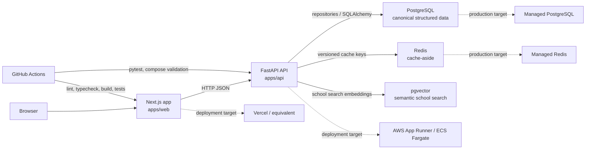

# Architecture

This document captures the current V1 architecture for the College Exploration Platform plus the planned V2/V3 expansion points.

## Target Shape

- `apps/web`: Next.js frontend for onboarding, search, school profiles, comparison, cost/value estimates, sensitivity analysis, accepted-school decision workflows, printable decision reports, and internal analytics.
- `apps/api`: FastAPI backend for typed REST endpoints, validation, search, ranking, comparison, cost/value calculation, sensitivity analysis, decision report generation, analytics, and data access.
- PostgreSQL: canonical structured college data and user-owned decision state. The V1.2 schema exists under `apps/api/alembic`.
- pgvector: V2.2 semantic school retrieval over generated structured school search documents.
- Redis: cache-aside layer for repeated read-heavy search, profile, and ranking responses.
- `data/raw`: raw source snapshots, usually large and not committed.
- `data/processed`: cleaned local development data.
- `data/seed`: small deterministic fixtures for tests and demos.
- `infra`: local and cloud infrastructure notes and configuration.

## System Diagram

## Boundaries

- The frontend must not query PostgreSQL directly.
- The backend owns validation, persistence, scoring, ranking, and API contracts.
- Data ingestion should stay separate from user-facing API routes.
- Deterministic ranking and reason codes must stay separate from any future LLM copy generation.

## Backend Structure

The V1.3 FastAPI foundation lives in `apps/api`:

- `main.py`: app factory, router registration, and exception handler registration.
- `api/`: HTTP routers and request dependencies.
- `core/`: settings, logging, and global error handling.
- `db/`: SQLAlchemy base, engine, and session factory.
- `models/`: SQLAlchemy ORM models matching the Alembic schema.
- `schemas/`: Pydantic API request/response models.
- `repositories/`: data access layer. SQL belongs here, not in route handlers.
- `services/`: business logic layer placeholders between routes and repositories.
- `ingestion/`: deterministic V2.1 CSV pipeline for public college-data snapshots.
- `tests/`: pytest tests for backend behavior.

Request flow should be `routes -> services -> repositories -> database`. Routes own HTTP concerns, services own product logic, repositories own persistence, and models mirror database tables.

## Data Ingestion Pipeline

V2.1 keeps ingestion separate from API routes. `apps/api/ingestion/college_data.py` implements a deterministic CSV pipeline:

1. Raw import reads public college-data style snapshots from `data/raw` or small test fixtures.
2. Normalization maps source-style columns such as `UNITID`, `INSTNM`, `CONTROL`, `LOCALE`, and Scorecard metric names into the product school schema.
3. Missing-value handling converts blanks, `NULL`, `NaN`, and privacy-suppressed tokens to `None`; missing numeric values are never converted to zero.
4. Derived attributes fill product-friendly fields such as region from state, school type from control code, setting from locale code, and net price from the applicable public/private source field.
5. Validation checks required identity fields, duplicate unit IDs, known rate ranges, nonnegative numeric values, and unavailable ranking inputs.
6. Seed/refresh output writes deterministic canonical CSV rows sorted by `unitid`.

The CLI in `apps/api/scripts/ingest_college_data.py` exposes `import`, `validate`, `seed`, and `refresh` commands. Generated outputs are intended for local seeding with `scripts/seed_database.py`; large raw snapshots and processed outputs are not committed. Source metadata is carried through to `schools.source_name`, `schools.source_year`, `schools.data_version`, `schools.imported_at`, and `schools.refreshed_at`.

## School API Query Strategy

`GET /schools/search` uses the standard backend layers:

- `api/routes/schools.py` parses and validates query parameters.
- `services/schools.py` builds response metadata.
- `repositories/schools.py` composes a SQLAlchemy query over `schools`, `school_costs`, and `school_academics`.

The repository uses left joins so schools with missing optional cost or academic fields can still appear when filters allow them. Filters are composed with SQLAlchemy expressions, keeping values parameterized. The response returns only search-card fields and avoids full school profile data. Search logs include query execution time, returned row count, total results, page, and page size.

Indexes from V1.2 support common filters and sorts on state, region, type, setting, enrollment, acceptance rate, graduation rate, tuition, and net price. To inspect a slow query locally, run the generated SQL through `EXPLAIN ANALYZE` against Postgres.

`GET /schools/{id}` follows the same layering:

- `api/routes/schools.py` handles path parsing, response typing, and HTTP 404 behavior.
- `services/schools.py` composes the nested profile response and computes missing-data metadata.
- `repositories/schools.py` reads the profile with one left-joined query across `schools`, `school_academics`, `school_costs`, `school_outcomes`, and `school_campus_life`.

Profile responses keep missing values as `null`, list missing dot-paths in `data_fields_missing`, and expose a simple completeness-based `data_confidence_score`. Profile ranking placeholders remain empty; similar-school discovery is loaded through `GET /schools/{id}/similar`.

`POST /rankings` follows the same layering:

- `api/routes/rankings.py` validates the ranking request and response shape.
- `services/ranking_service.py` owns deterministic category scoring, normalized weights, hard constraints, confidence, reason codes, tradeoffs, and stable ordering.
- `repositories/schools.py` fetches all V1 ranking inputs with one left-joined query across core, academic, cost, outcome, and campus-life tables.

Ranking is computed in memory for V1 scale after the repository query. Missing values remain unknown: they produce neutral category fit and lower confidence rather than zero-valued penalties. The ranking version is currently `v1.0`.

`POST /semantic-search` adds V2.2 hybrid retrieval:

- `services/semantic_search.py` builds deterministic school search documents from school identity, location, type/setting, majors, costs, outcomes, campus/culture tags, and V2.1 source metadata.
- `scripts/refresh_embeddings.py` writes versioned embeddings to `school_embeddings` using the local deterministic provider unless a future provider is wired in.
- The repository retrieves pgvector candidates from `school_embeddings` when vectors are available. If embeddings or pgvector are unavailable, the service uses a deterministic lexical fallback over the same generated documents.
- Structured filters and ranking hard constraints are applied after retrieval. Vector similarity narrows candidates but does not override hard constraints or final deterministic ranking.
- Responses expose semantic match reason tags such as `major_match`, `location_match`, `setting_match`, `cost_value_match`, `outcomes_match`, and `campus_culture_match`.

`GET /schools/{id}/similar` adds V2.3 profile-page discovery:

- `services/similar_schools.py` retrieves semantically similar candidates with pgvector when embeddings exist and falls back to deterministic lexical similarity over V2.2 search documents.
- The source school is always excluded, duplicate name/city/state candidates are removed, and structured constraints are applied before response assembly.
- Variants are deterministic: `cheaper` biases and filters toward lower net price, `less_selective` toward higher acceptance rate, `smaller` toward lower enrollment, `stronger_outcomes` toward stronger graduation or earnings, and `closer_to_home` toward the supplied `home_state`.
- The service reuses ranking code for fit score, top reasons, and tradeoffs, but final similarity also includes explicit source-school similarity and variant scores.

`POST /decision/offers`, `GET /decision/offers`, and `POST /decision/report` add V2.4 acceptance decision mode and the V2.7 shareable decision report:

- `models/decision.py` and the `20260521_0004` migration add `acceptance_offers` and `decision_summary_snapshots`.
- `repositories/decision.py` owns accepted/finalist offer upserts, saved-school status alignment, report candidate reads, and snapshot writes.
- `services/decision.py` reuses `RankingService.score_school`, cost/value calculator result builders, and deterministic sensitivity reranking helpers to keep fit, value, career, risk, cost, and stability summaries grounded in structured inputs.
- Decision confidence flags call out missing offer costs, incomplete preference weights, missing outcomes metrics, limited school data, and too few finalists. Unknown values lower confidence rather than becoming zero-valued ranking inputs.
- V2.7 report responses include recommendation cards, finalist ranking rows, category score rows, cost/value rows, sensitivity highlights, major tradeoffs, unresolved questions, a methodology note, and lightweight share paths. Snapshot persistence still uses `decision_summary_snapshots` so future hosted export/share flows can start from a stable report payload.
- The current no-auth local workflow uses `user_id=1` as a demo workspace boundary. V3 account persistence should replace this with authenticated user ownership.

`POST /cost-calculator` adds V2.5 cost/value comparison:

- `schemas/cost_calculator.py` validates one to eight school assumptions for tuition, net price, scholarships, grants/aid, yearly cost, and optional loan assumptions.
- `services/cost_calculator.py` owns deterministic calculations for yearly cost, four-year total cost, baseline cost differences, estimated debt exposure, lower/base/higher repayment scenarios, affordability indicators, directional value labels, formulas, and warnings.
- `repositories/schools.py` reads the observed cost and outcome fields needed by the calculator from school, cost, academic, and outcome tables. Route handlers do not write SQL.
- Missing aid, net price, debt, or outcomes data creates warnings and lowers confidence. Unknown values are never converted to zero for comparison or value labels.
- The calculator is separate from ranking and decision fit. It can say a school looks stronger financially under current assumptions without changing best-fit ranking outputs.

`POST /sensitivity` adds V2.6 sensitivity analysis:

- `schemas/sensitivity.py` validates the base preference profile, 1 to 8 weight scenarios, optional selected candidate IDs, and supported dimensions.
- `services/sensitivity.py` reads ranking candidate rows, delegates baseline and scenario ordering to `RankingService.rank_rows`, and compares deterministic movement.
- Stable choices remain highly ranked with little movement across scenarios. Volatile choices have material rank or fit-score movement when one priority changes.
- Category drivers, confidence impacts, and tradeoff explanations are derived from existing category scores, confidence scores, reason codes, and rank deltas.
- `prestige_selectivity` is represented as a selectivity-emphasis scenario over `admissions_realism`; it does not add an opaque prestige model.
- Sensitivity responses use Redis cache-aside with keys that include the request, normalized preference/profile snapshot, `CACHE_KEY_VERSION`, and `RANKING_VERSION`.

`POST /analytics/events` and `GET /analytics/summary` add V2.8 analytics and ranking evaluation:

- `models/event.py` stores typed product events in the existing `events` table. Events are sanitized before persistence so raw search text, notes, emails, aid offers, scholarships, and other sensitive user-entered details are not stored.
- `schemas/analytics.py` defines the supported event names and internal analytics response contracts.
- `repositories/analytics.py` owns event persistence and event reads. Aggregation is intentionally service-side for the current fixture-scale V2 scope.
- `services/analytics.py` builds deterministic metrics for most-used filters, most-viewed schools, most-saved schools, compare frequency, onboarding completion rate, save rate by rank position, report-generation frequency, ranking-version usage, save rate by fit-score bucket, compare rate by ranking position, reason-code frequency, confidence distribution, and category-weight summaries.
- API routes auto-log privacy-safe events for structured search, semantic search, school profile views, rankings, sensitivity adjustments, and decision reports. Frontend local-only actions log save, compare, onboarding completion, and local fallback report events.
- V2.8 metrics are descriptive product telemetry. They are not causal claims, admissions advice, financial advice, or production observability.

## Cache Strategy

V1.12 adds a centralized cache service in `apps/api/services/cache.py`. Routes still call services, and services decide whether to return a cached response or call the repository. Redis-specific behavior is isolated behind a small backend abstraction so the API can fall back to normal database reads when Redis is unavailable.

Cached resources:

- Search responses use keys based on all search filters, pagination, sort, and direction. TTL: 300 seconds.
- School profiles use keys based on `school_id`. TTL: 3600 seconds.
- Ranking responses use keys based on the full ranking request plus the deterministic `RANKING_VERSION`. TTL: 300 seconds.
- Semantic search responses use normalized query text, filters, preferences, embedding type/model, and `RANKING_VERSION`. TTL: 300 seconds.
- Similar-school responses use source school id, variant request parameters, embedding type/model, and `RANKING_VERSION`. TTL: 300 seconds.
- Sensitivity responses use the scenario request, normalized profile snapshot, and `RANKING_VERSION`. TTL: 300 seconds.

All keys include `CACHE_KEY_VERSION` so a deployment or operator can invalidate the namespace without deleting individual keys. Ranking keys also include the ranking formula version, so future formula updates cannot reuse stale ranking output from an older version.

Cache logging records `cache_hit`, `cache_miss`, Redis unavailable fallback, and write/invalidation failures. Cache hits include `db_call_avoided=true`; misses include `db_call_required=true` for lightweight performance validation without claiming production latency.

## Frontend Structure

The V1 frontend lives in `apps/web`:

- `app/`: App Router layout, landing page, onboarding page, search page, loading state, not-found page, and route-level error boundary.
- `components/ui/`: Small typed UI primitives that follow shadcn/ui-compatible composition patterns without introducing a generated component registry yet.
- `components/onboarding/`: Multi-step local preference quiz for academic, cost, career, location, campus, admissions, and category-weight inputs.
- `components/search/`: URL-synced school search experience, result cards, filter panel, pagination, and save/compare actions.
- `components/dashboard/`: Browser-local saved schools dashboard grouped by decision status.
- `components/compare/`: Sticky compare tray and comparison workspace for 2 to 5 locally selected schools, including editable V2.5 cost/value assumptions and V2.6 sensitivity analysis sliders.
- `components/decision/`: Accepted-schools workspace with editable offer cards, notes, finalist comparison, report-ready summary panel, and printable decision report page.
- `components/analytics/`: Internal analytics dashboard with metric cards, bar charts, ranking evaluation distributions, and privacy/limitations notes.
- `lib/api-client.ts`: Safe fetch wrapper for backend calls, JSON error handling, and typed response usage.
- `lib/preferences.ts`: Local preference profile schema, completeness calculation, localStorage persistence, and search-parameter handoff.
- `lib/search.ts`: Frontend search filter parsing, API query serialization, and sort mapping.
- `lib/school-actions.ts`: Typed browser-local saved-school and compare state, including legacy ID migration, duplicate prevention, status updates, and a 5-school compare limit.
- `lib/comparison.ts`: Deterministic comparison summary and category winner helpers. It does not call an LLM or invent missing school facts.
- `lib/decision.ts`: Browser-local decision offer and latest-report persistence, optional backend sync/report calls, and deterministic local fallback summaries for demo continuity.
- `lib/analytics.ts`: Privacy-safe frontend event client and analytics summary fetcher.
- `lib/cost-calculator.ts`: Cost/value calculator API client plus deterministic local fallback for compare and decision workflows when the API is unavailable.
- `lib/sensitivity.ts`: Sensitivity-analysis API client and local preference-profile adapter. The frontend does not compute rankings; it sends selected school IDs and scenario weights to `/sensitivity`.
- `lib/env.ts`: Environment-based API base URL resolution using `NEXT_PUBLIC_API_BASE_URL`, defaulting to `http://localhost:8000`.
- `types/api.ts`: Frontend TypeScript contracts for currently consumed API shapes.

The frontend talks to the backend over HTTP only. It does not query PostgreSQL and does not compute ranking scores. The onboarding page stores a typed V1 local preference profile in browser storage because `POST /preferences` is still planned. After completion, it routes to `/search` with the subset of preferences currently supported by `GET /schools/search`. The search page keeps filters, sort, and pagination in the URL, calls `GET /schools/search`, and treats ranking fields as optional placeholders.

V1.11 saved-school and comparison state is browser-local because no authenticated user session exists. Saved schools are stored under `college-exploration.saved-schools.v1` with statuses `interested`, `applying`, `accepted`, `finalist`, and `removed`. Compare selections are stored under `college-exploration.compare-schools.v1`, deduplicated, capped at 5 schools, and shared by the sticky tray across pages. `/dashboard` reads the local saved-state snapshot; `/compare` reads local compare IDs and fetches full school profiles over `GET /schools/{id}` before rendering deterministic comparisons.

V2.4 decision offer state is stored locally under `college-exploration.decision-offers.v1` for the frontend demo flow and can sync to the backend `/decision/offers` endpoint when the API is running. `/decision` filters saved schools to accepted/finalist status, captures offer costs and notes, and renders a report-ready summary. If `/decision/report` is unavailable, the UI uses a deterministic local fallback that still marks missing backend fit/outcome/financial data as uncertainty. V2.7 stores the latest generated report under `college-exploration.decision-report.v1` and renders it at `/decision/report` as a clean printable/shareable briefing. V2.5 calculator panels in `/decision` and `/compare` call `/cost-calculator` when available and otherwise use the same transparent local formulas for recruiter-demo continuity. V2.6 sensitivity analysis in `/compare` calls `/sensitivity` with browser-local onboarding preferences when available and default weights otherwise; it shows API errors rather than inventing ranking movement locally.

V2.8 adds `/analytics` as an internal demo surface. It reads `GET /analytics/summary`, renders lightweight cards and bar charts, and keeps caveats visible. This is not a production admin console; authentication, authorization, long-term retention controls, alerting, and warehouse export belong to V3.

## Deployment Shape

V1.13 adds production-oriented Dockerfiles for the frontend and backend plus Docker Compose wiring for local full-stack validation. The documented deployment target is Vercel or equivalent for `apps/web`, AWS App Runner or ECS/Fargate for `apps/api`, managed PostgreSQL for the database, and managed Redis for cache-aside reads.

GitHub Actions validates frontend lint/typecheck/build, Playwright smoke tests, backend tests, and Docker Compose syntax. It does not currently deploy to a public environment.

## Not Implemented Yet

Health, readiness, structured school search, school profile endpoints, deterministic ranking, Redis cache-aside, frontend foundation, onboarding, search UI, school profiles, browser-local saved schools, browser-local comparisons, Docker packaging, deployment documentation, CI validation, the V2.1 ingestion pipeline, V2.2 semantic retrieval, V2.3 similar-school discovery, V2.4 acceptance decision mode, V2.5 cost/value calculator, V2.6 sensitivity analysis, V2.7 shareable decision reports, and V2.8 analytics/ranking evaluation are implemented. Backend preference persistence, authenticated saved schools/comparisons, production-grade report sharing, public cloud deployment, production observability, and load-test reporting are not implemented yet.
